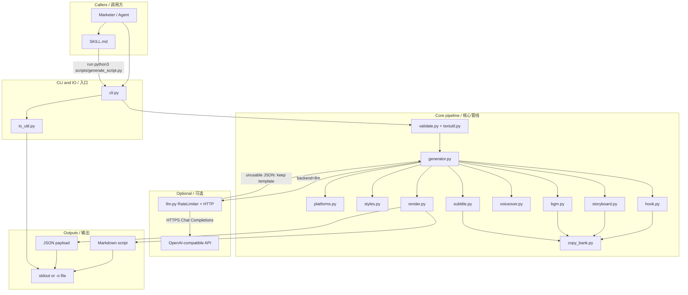
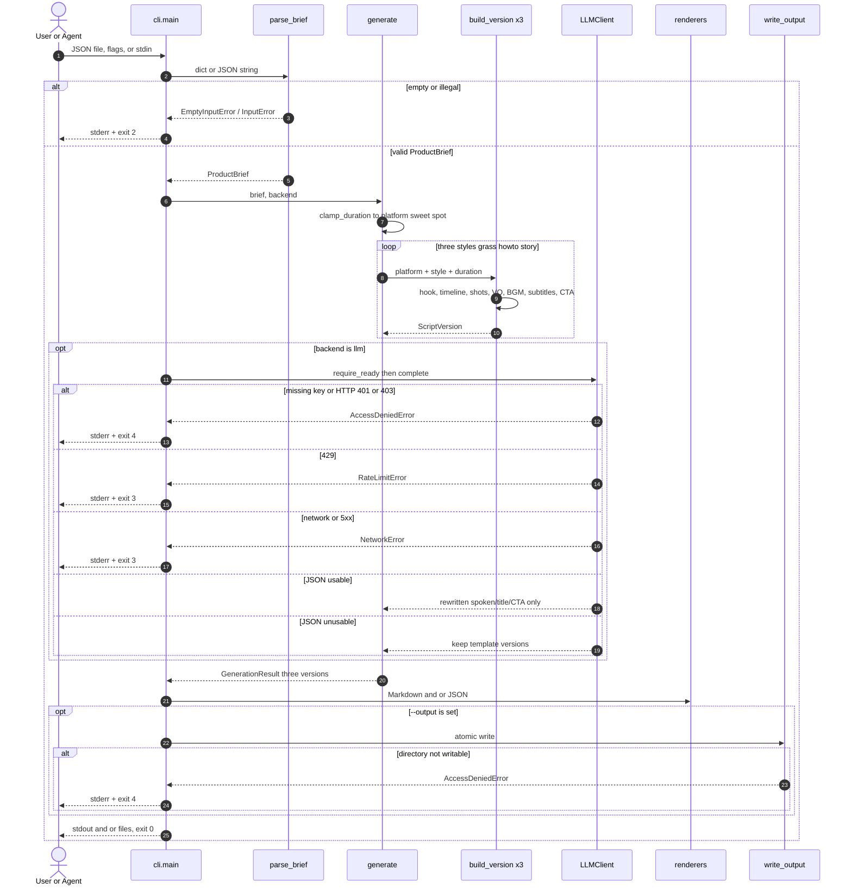
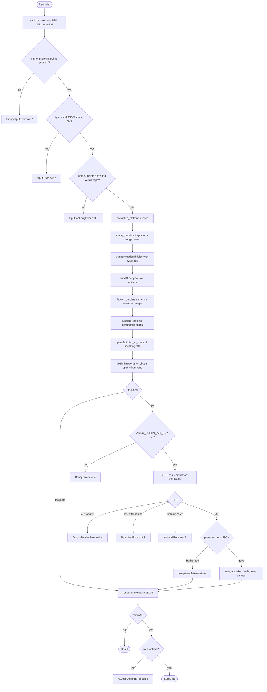

# Architecture

This page is the visual map of **skill-video-script**: where a product brief enters, how three platform-aware scripts are assembled, and where the optional LLM sits. The diagrams match the Python package in `src/video_script/` (version 0.1.0). They are not a second implementation.

本页是 skill-video-script 的结构图：brief 从哪里进来、三份平台脚本怎么拼出来、可选 LLM 挂在哪一层。图与 `src/video_script/` 中 0.1.0 的包结构一致，不是另一套实现。

Interactive walkthrough: [demo/index.html](../demo/index.html).

---

## 1. System architecture / 系统架构

### Design notes / 设计说明

**中文。** 架构刻意把「永远能跑的模板管线」和「可插拔的大模型」拆开。`cli.py` 只负责收 brief 和写盘；`validate.py` 把脏输入挡在生成之前；`generator.py` 按平台 playbook 和三种风格编排，真正的文案槽位集中在 `copy_bank.py`。口播、分镜、BGM、字幕各有模块，是因为它们的约束不同：分镜必须时间轴连续，口播必须卡字速，BGM 禁止点名无授权热歌。运行时零第三方依赖，外部系统只有可选的 OpenAI 兼容网关。失败时 LLM 不得清空模板结果。这样开源贡献者可以先改 playbook，而不必先配密钥。图中的箭头也反映真实调用：Skill 文档不执行代码，只要求 Agent 去跑 CLI。我们没有把平台规则写进 prompt，是因为时长和黄金三秒必须可测、可回归，而不是碰运气。

**English.** The split is deliberate: a template pipeline that always runs, and an LLM that is allowed to sit beside it, never in front of it. `cli.py` only collects a brief and writes bytes. `validate.py` stops illegal input before any copy is built. `generator.py` orchestrates three styles against a platform playbook; the actual Chinese slots live in one place, `copy_bank.py`, so we do not duplicate slogans across modules. Hook, storyboard, voiceover, BGM, and subtitles are separate because their invariants differ — contiguous timings, speaking-rate caps, and “no pirated track titles” are not the same kind of rule. Runtime depends on the standard library only. The only external system is an optional OpenAI-compatible Chat Completions endpoint. If that endpoint returns junk, timings and storyboard stay on the template result. Contributors can change a playbook without owning an API key. `SKILL.md` is a prompt for agents, not a second runtime: it tells the agent to invoke the CLI. Platform rules stay in data rather than in a prompt so that duration and the golden three seconds remain testable, not a matter of luck on the next model version. Putting Chart.js or a web UI in this core diagram would have lied about the runtime: the packaged skill is a CLI, and the demo page is a separate, optional visualization.

---

## 2. Sequence: input to output / 从输入到输出

### Design notes / 设计说明

**中文。** 时序图把失败码画进主路径，而不是事后补丁。校验失败必须在生成之前退出，避免半成品脚本被当成成功交付。三种风格是串行的 `build_version`：模板填充是纯函数、瞬时完成，并行没有收益，却会让日志和测试更难读。LLM 只改口播、标题、CTA，不改时间轴——否则「黄金 3 秒」和分镜秒数会对不上，剪辑同学无法按表拍。写盘走临时文件再 `os.replace`，避免中断留下半截 Markdown。退出码 2/3/4 对应输入、网络、权限，方便 Agent 和 CI 分支处理。用户永远先拿到三份完整结构，再决定要不要花钱做润色。密钥检查发生在第一次 HTTP 之前，这样缺配置不会先空跑一遍生成再失败。

**English.** Failures are first-class in the sequence, not an appendix. Validation exits before generation so a half-built script is never presented as success. The three styles run as a serial `build_version` loop: filling templates is pure and cheap, so a thread pool would add noise without shortening the happy path. The LLM is allowed to rewrite spoken lines, titles, and CTAs; it is not allowed to rewrite the timeline. If it did, the golden three-second hook and the storyboard clock would drift, and an editor could not shoot from the table. File output is temp-file plus `os.replace` so a killed process does not leave a truncated Markdown file. Exit codes 2 / 3 / 4 map to input, network, and permission so an agent or CI job can branch. The user always receives three complete skeletons first; paying for a rewrite is optional. The client checks for an API key before the first HTTP call, so a missing credential fails fast instead of generating three versions and then dying. We also keep stdin, flags, and JSON files on one parse path so the Skill, the CLI, and the library cannot disagree about what a valid brief is.

---

## 3. Data-processing flow / 数据处理流程

### Design notes / 设计说明

**中文。** 处理流程是「先拒绝，再截断，再生成」。名称和卖点超硬限制直接报错，因为截断品名会改掉传播语义；受众、描述等次要字段才允许截断并写入 `warnings`。平台别名在校验阶段就归一化，后面模块只认 `douyin` / `wechat` / `bilibili` 三个 id。时长先接受 8–180 秒的合法整数，再夹到平台甜区并警告——非法数字和「偏短但合法」不是同一类错。黄金 3 秒优先完整短句，而不是把长模板从中间切断。LLM 分支的每一种 HTTP 结果都有出口，禁止把网络失败伪装成空脚本。最后才碰磁盘。这张图也是测试清单：`tests/test_boundaries.py` 的八类边界与菱形一一对应。控制字符和双向覆盖在最前清洗，避免品名把 Markdown 表格撑破，也避免不可见字符混进口播。

**English.** The pipeline refuses first, truncates second, generates third. A product name or selling point over the hard cap is an error, because silently shortening a name changes what will be said on camera. Secondary fields (audience, description) may truncate with a warning. Platform aliases collapse during validation so later modules only see `douyin`, `wechat`, or `bilibili`. Duration is a two-step rule: illegal numbers die at parse time; values inside 8–180 seconds may still be clamped to the platform sweet spot with a warning — those are different classes of mistake. The golden three seconds prefer a complete short sentence over a mid-word cut of a long template. Every HTTP outcome on the LLM branch has an exit; a network failure must not be dressed up as an empty script. Disk is the last side effect. The diamonds in this chart are also the test plan: the eight cases in `tests/test_boundaries.py` map onto them one by one. Control characters and bidi overrides are stripped first so a product name cannot break a Markdown table or hide glyphs inside the voiceover. Warnings ride along on the result instead of being printed only to stderr, so a Markdown paste into a briefing doc still shows that duration was clamped.

---

## Module index / 模块索引

| Module | Role |
| --- | --- |
| `cli.py` | argparse, exit codes, stdout vs `-o` |
| `validate.py` | JSON / flags → `ProductBrief` |
| `textutil.py` | sanitize, trim, Markdown escape |
| `platforms.py` | Douyin / Channels / Bilibili playbooks |
| `styles.py` | grass / howto / story + shot roles |
| `copy_bank.py` | Chinese templates (single source of copy) |
| `hook.py` | golden 3-second opening |
| `storyboard.py` | contiguous timeline + shots |
| `voiceover.py` | timecoded teleprompter |
| `bgm.py` / `subtitle.py` | library keywords, captions, hashtags, CTA |
| `generator.py` | orchestration of exactly three versions |
| `render.py` | Markdown and JSON |
| `llm.py` | optional HTTP rewrite + token bucket |
| `io_util.py` | atomic writes, permission errors |
