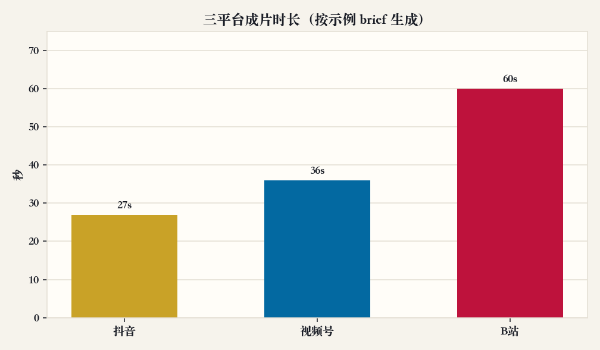
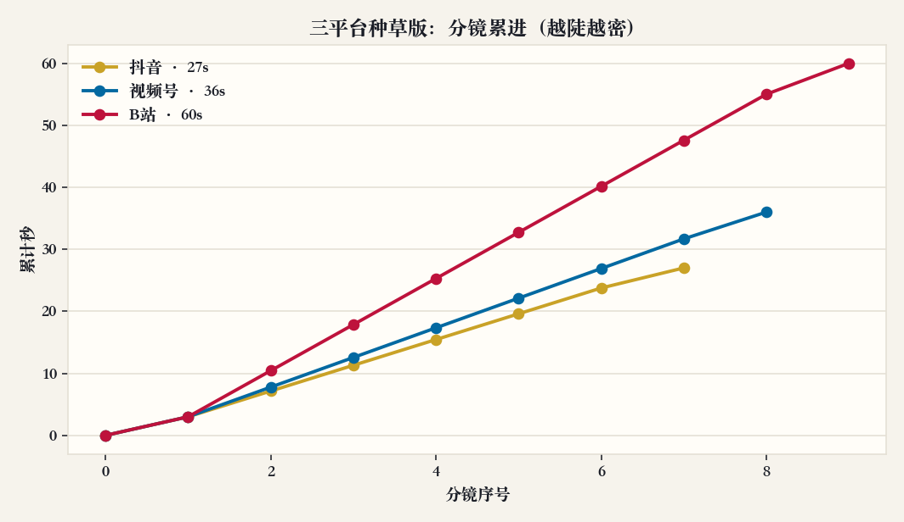
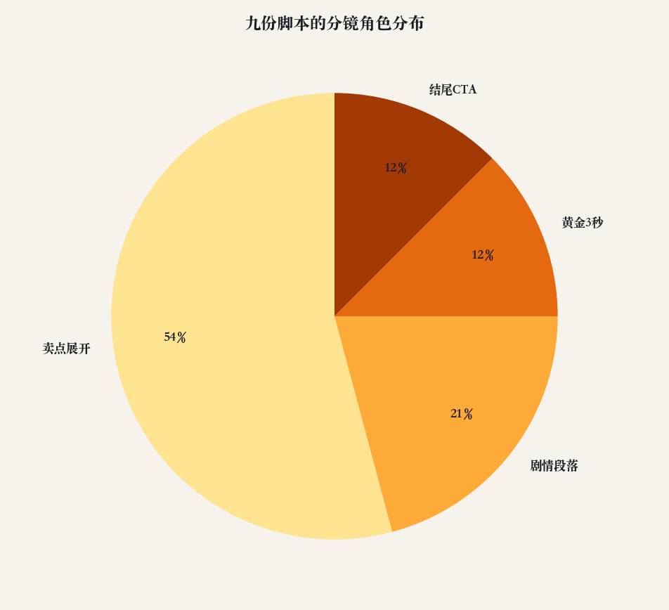
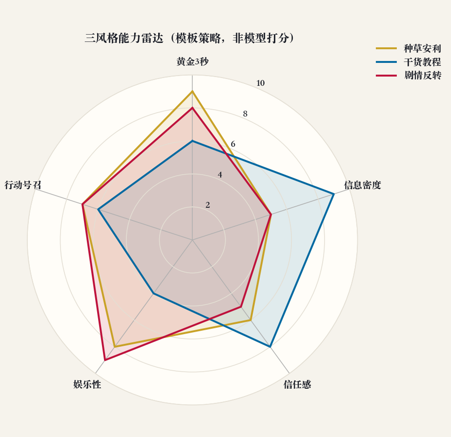
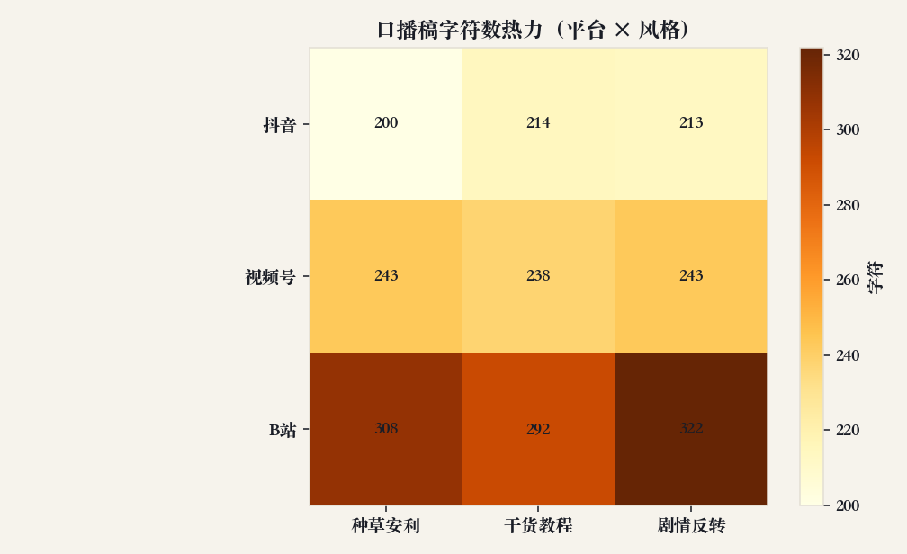

# 短视频脚本产能简报（样例）

**交付对象：** 品牌社媒 / 内容运营  
**数据来源：** 仓库内三份真实 brief（`examples/*.json`）经 `skill-video-script` 0.1.0 模板引擎生成  
**复现：** `PYTHONPATH=src python3 scripts/generate_report.py`

本页模拟交给营销团队的一页纸分析：不是「模型觉得好看」，而是把九份脚本（3 平台 × 3 风格）的结构摊开，决定本周先拍哪条、口播怎么控字。

---

## 1. 平台时长不是同一把尺

| 示例 | 平台 | 生成时长 |
| --- | --- | --- |
| 清润防晒霜 | 抖音 | 27s |
| 便携胶囊咖啡机 | 视频号 | 36s |
| 星核机械键盘套件 | B站 | 60s |

**发现。** 同一套「三风格」骨架，甜区差一倍以上。抖音 27 秒只够一个钩子 + 两三个卖点 + CTA；B 站 60 秒才容得下开箱细节。若运营用同一份口播稿三个平台分发，不是「换封面」，是信息过载或信息空洞。

**建议。** 周更先锁平台再锁风格。货架品（防晒）走抖音 27 秒种草；需要信任的小家电走视频号 36 秒；参数多的外设走 B 站 60 秒干货或反转。不要把 B 站口播压缩进抖音前 8 秒。

---

## 2. 分镜累进：越陡，单镜信息越密

**发现。** 三条线都从 0 走到平台总时长，但斜率不同。抖音 7 镜在 27 秒内走完，单镜约 3–4 秒，容错低：黄金 3 秒一旦含糊，后面没有补救镜。B 站 9 镜摊在 60 秒，中段可以放 demo / detail。视频号夹在中间，适合「先痛点后证明」。

**建议。** 拍抖音时把产品在 0.5 秒内入画；拍 B 站时预留一镜给「手怎么放」。剪辑表直接用生成稿里的 `start_sec–end_sec`，不要凭感觉拉长钩子。

---

## 3. 九份脚本的角色结构

**发现。** 把 3×3 份分镜按功能归并后，**卖点展开**占最大块，**黄金 3 秒**与 **CTA** 各约一成（每份脚本各一镜）。剧情段落只出现在「剧情反转」风格里，所以整体占比小于卖点展开——这是策略结果，不是漏写。

**建议。** 若本周目标是完播，优先拍种草或反转（钩子和娱乐性更高，见下一张雷达）。若目标是收藏和私信，把预算给干货教程，接受钩子更「目录化」。不要要求同一条视频既剧情又三步教程：角色池会互相挤占。

---

## 4. 三风格不是换标题

分数来自模板策略（与 demo 雷达一致），不是大模型打分，便于周与周对比。

| | 黄金3秒 | 信息密度 | 信任感 | 娱乐性 | CTA |
| --- | --- | --- | --- | --- | --- |
| 种草安利 | 高 | 中 | 中 | 高 | 中高 |
| 干货教程 | 中 | 高 | 高 | 低 | 中 |
| 剧情反转 | 高 | 中 | 中 | 高 | 中高 |

**发现。** 干货在「信息 / 信任」上凸起，娱乐性最低——适合视频号「像朋友教你」。种草和反转抢的是停滑，不适合第一次讲清参数。

**建议。** A/B 不要比「哪句更好听」，要比「哪一种雷达形状匹配 KPI」。完播实验：种草 vs 反转。咨询/私信实验：干货。三版都拍只在大促。

---

## 5. 口播字数热力

**发现。** 字数随平台时长上升：抖音约 200 字，视频号约 240 字，B 站约 290–320 字。同一平台三种风格的字数差在 20 字以内——引擎在按字速裁剪，而不是某一种风格「更啰嗦」。B 站剧情版略长（322），因为反转需要多一句冲突。

**建议。** 出镜同学按时间码念，不要自行加段。若体感仍赶，优先删中段「detail」，不要删钩子或 CTA。法律审核只需要看 brief 里出现过的卖点：生成器不会编造疗效。

---

## 本周动作清单

1. 先拍 **抖音 × 种草**（27s，清润防晒霜示例路径），验证黄金 3 秒完播。  
2. 用 **视频号 × 干货** 做一版「三步用法」，CTA 改关注/私信，不要上小黄车话术。  
3. B 站键盘套件走 **剧情反转**，口播控制在 ~320 字，分镜表 9 镜不要减到 6 镜。  
4. 复盘时把本页五张图重跑一遍（同一脚本），字数热力若突然翻倍，说明有人手工粘了长口播。

图表由 `scripts/generate_report.py` 生成，配色与 [demo](../../demo/index.html) 一致（纸色 + 金 / 蓝 / 玫瑰）。
